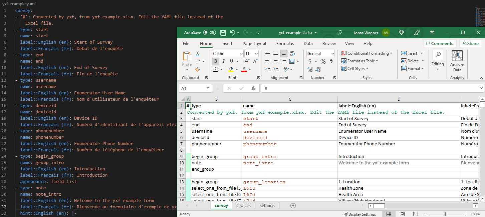

# Convert from XLSForm to YAML and back

yxf (short for **Y**AML **X**LS**F**orms) is a converter between XLSForms and
YAML files. With yxf, you can store forms as text-files. This brings a number of
advantages to managing many forms. For example, you can store forms in version
control, view differences between two forms, and easily share updates between
multiple forms.

## Usage

To convert an XLSForm to a YAML file: `python -m yxf form.xlsx`.

By default, the result will be called `form.yaml`, in other words, the same name
as the input file with the extension changed to `.yaml`. You can specify a
different output file name using the `--output othername.yaml` option.

To convert a YAML file to an XLSForm: `python -m yxf form.yaml`.

Here's a screenshot showing the YAML and XLSForm version of a form side-by-side:



## Installation

Get the latest version from the GitHub repo:

```
python -m pip install 'git+https://github.com/Sjlver/yxf.git'
```

## Comments in forms

yxf encourages adding comments to XLSForms. It uses a special column labeled `#`
to that end. Other tools ignore this column, so that it can be used for
explanations that are useful to the readers of the `.xlsx` or `.yaml` files.

## Development

yxf is in an early stage of development. Feedback and contributions are welcome.
Please open issues in the [issue tracker](https://github.com/Sjlver/yxf/issues).

Please run all of the following before committing:

- Format the code: `black .`
- Run unit tests: `pytest`
- See lint warnings (and please fix them :)): `pylint yxf`